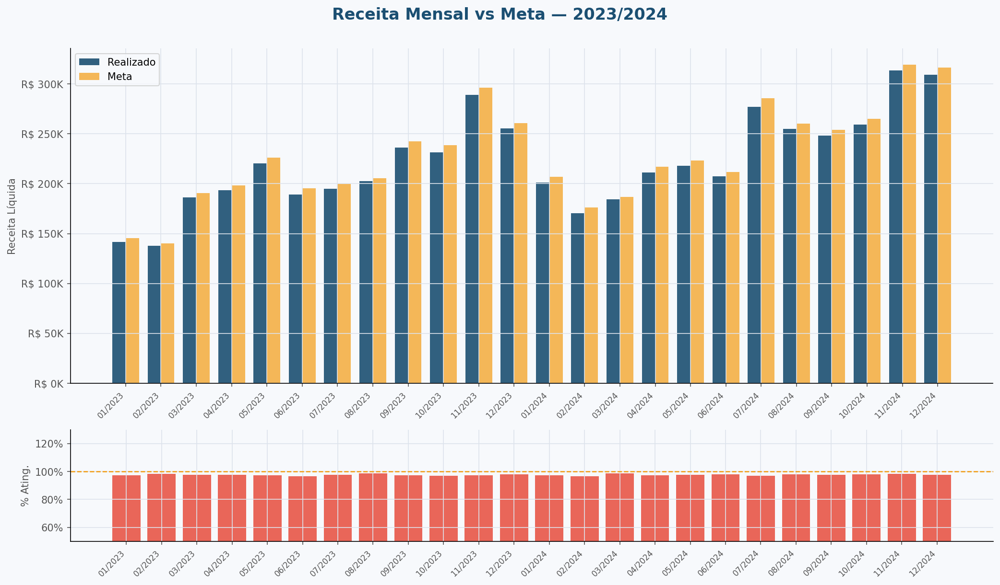
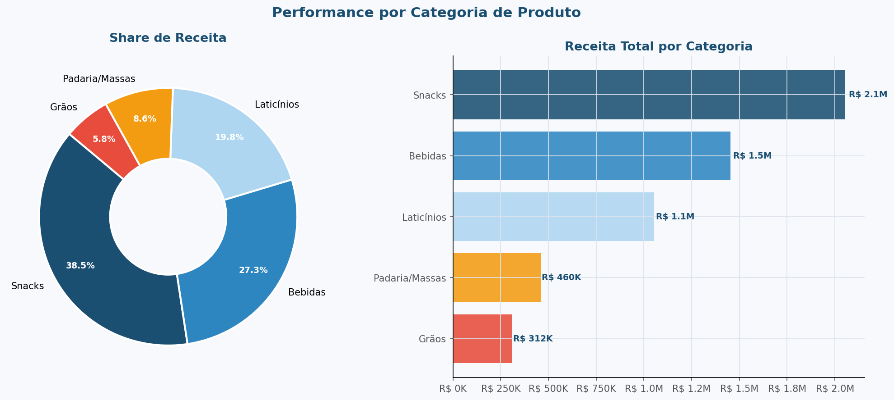
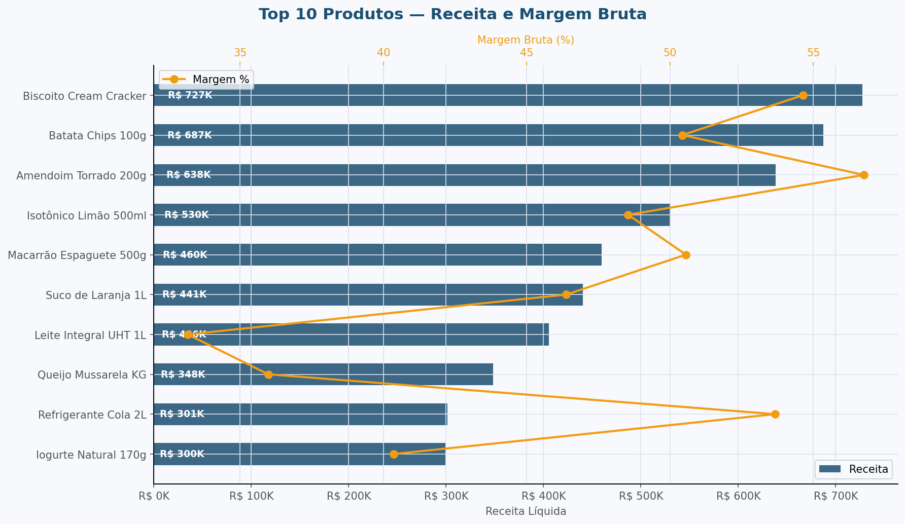
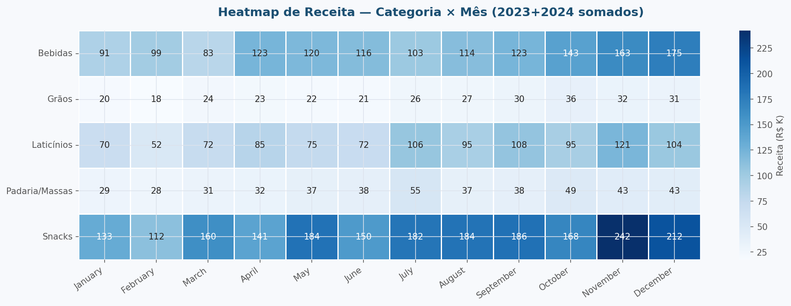
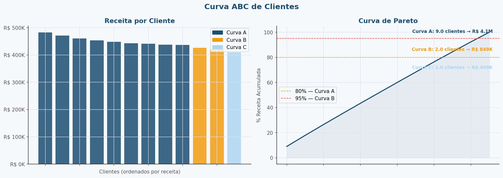
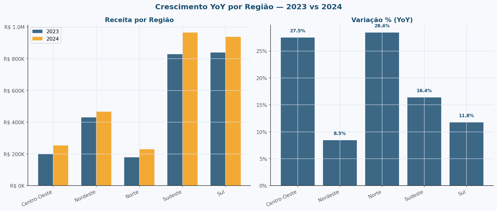

# 📊 Industrial Sales Analytics

> Análise end-to-end de performance comercial para o setor industrial — SQL · Python · Visualização de Dados


---

## 🎯 Contexto e Objetivo

Este projeto simula o ambiente analítico de uma **indústria de alimentos e bebidas**, cobrindo 2 anos de dados de vendas (2023–2024) com mais de **8.000 pedidos** e **R$ 5,3M em receita**.

O objetivo foi construir um pipeline de dados completo — da modelagem do banco até as visualizações executivas — respondendo às seguintes perguntas de negócio:

- Qual foi o atingimento de receita vs. meta mês a mês?
- Quais categorias e produtos geram mais receita e margem?
- Como identificar os clientes estratégicos via Curva ABC?
- Qual foi o crescimento Year-over-Year por região?
- Onde estão os maiores volumes de devolução?

---

## 🏗️ Arquitetura do Projeto

```
industrial-sales-analytics/
│
├── sql/
│   ├── 01_create_schema.sql        # Modelagem dimensional Star Schema
│   └── 02_analytical_queries.sql   # Queries analíticas (CTEs, Window Functions)
│
├── data/
│   ├── generate_data.py            # Gerador de dados sintéticos realistas
│   └── vendas_industriais.csv      # Dataset gerado (8.000 registros)
│
├── notebooks/
│   └── analysis.py                 # Análise exploratória e visualizações
│
├── visualizations/                 # Outputs — 6 gráficos publicáveis
│   ├── 01_receita_vs_meta.png
│   ├── 02_share_categoria.png
│   ├── 03_top_produtos.png
│   ├── 04_heatmap_categoria_mes.png
│   ├── 05_curva_abc_clientes.png
│   └── 06_yoy_regiao.png
│
├── requirements.txt
└── README.md
```

---

## 🗄️ Modelagem de Dados — Star Schema

O banco foi modelado seguindo o padrão **Star Schema** com granularidade em nível de item de pedido.

```
                    ┌─────────────┐
                    │  dim_tempo  │
                    └──────┬──────┘
                           │
┌──────────────┐    ┌──────┴──────┐    ┌───────────────┐
│  dim_produto │────│ fato_vendas │────│  dim_cliente  │
└──────────────┘    └──────┬──────┘    └───────────────┘
                           │
              ┌────────────┴────────────┐
              │                         │
       ┌──────┴──────┐         ┌────────┴───────┐
       │ dim_vendedor│         │   dim_canal    │
       └─────────────┘         └────────────────┘
```

**Tabela Fato — Métricas disponíveis:**
- `receita_bruta`, `receita_liquida`, `margem_bruta`
- `quantidade`, `quantidade_dev` (devoluções)
- `meta_quantidade`, `meta_receita`
- `desconto_pct`, `custo_total`

---

## 🔍 SQL — Técnicas Utilizadas

| Recurso SQL | Aplicação |
|---|---|
| `CTEs` | Segmentação modular das queries analíticas |
| `Window Functions` | Curva ABC (acumulado), Rank de produtos, YoY |
| `RANK() OVER` | Ranking de receita por produto |
| `SUM() OVER` | % acumulado para Pareto de clientes |
| `LEFT JOIN` | Comparativo YoY sem perder períodos sem venda |
| `NULLIF` | Proteção contra divisão por zero em todos os KPIs |

---

## 📈 Visualizações Geradas

### 1. Receita vs Meta — Atingimento Mensal


---

### 2. Share de Receita por Categoria


---

### 3. Top 10 Produtos — Receita e Margem


---

### 4. Heatmap — Sazonalidade por Categoria e Mês


---

### 5. Curva ABC de Clientes (Pareto)


---

### 6. Crescimento YoY por Região


---

## 📊 KPIs do Projeto

| KPI | Valor |
|---|---|
| Total de Pedidos | 8.000 |
| Receita Líquida Total | R$ 5,3M |
| Margem Bruta Total | R$ 2,6M |
| Margem Bruta Média | 48,6% |
| Taxa de Devolução | 0,15% |
| Clientes Únicos | 12 |
| Produtos Únicos | 13 |

---

## 🚀 Como Executar

### Pré-requisitos

```bash
Python 3.11+
PostgreSQL 15+ (opcional — para rodar os SQLs)
```

### Instalação

```bash
git clone https://github.com/PauloColodiano/industrial-sales-analytics.git
cd industrial-sales-analytics
pip install -r requirements.txt
```

### Gerar os dados

```bash
python data/generate_data.py
```

### Rodar as análises e visualizações

```bash
python notebooks/analysis.py
```

### Banco de dados (PostgreSQL)

```bash
# Criar o schema
psql -U seu_usuario -d postgres -f sql/01_create_schema.sql

# Rodar as queries analíticas
psql -U seu_usuario -d industrial_sales -f sql/02_analytical_queries.sql
```

---

## 🧰 Stack Tecnológica

| Camada | Tecnologia |
|---|---|
| Banco de Dados | PostgreSQL 15 |
| Modelagem | Star Schema (dimensional) |
| ETL / Transformação | Python (pandas, numpy) |
| Visualização | matplotlib, seaborn |
| Geração de Dados | numpy (distribuição log-normal + sazonalidade) |

---

## 👨‍💻 Autor

**Paulo Augusto Colodiano Martins**
Analista de Dados & BI — SQL | Python | Power BI

[](https://www.linkedin.com/in/martins-paulo/)
[](https://github.com/PauloColodiano)

---

## 📄 Licença

MIT License — sinta-se à vontade para usar como base para seus próprios projetos.
